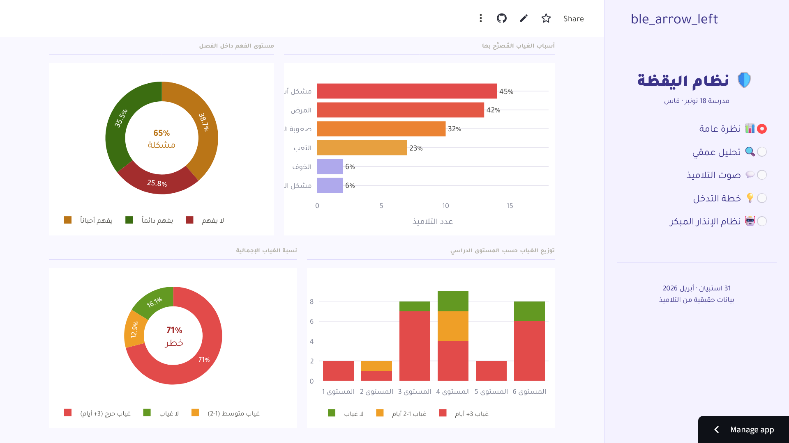
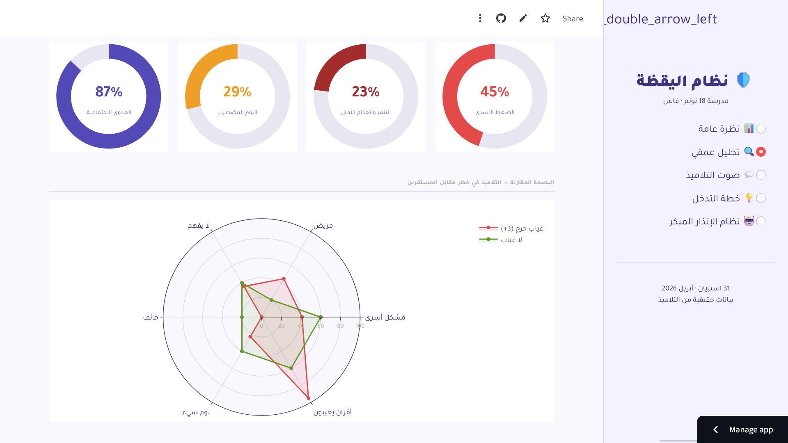
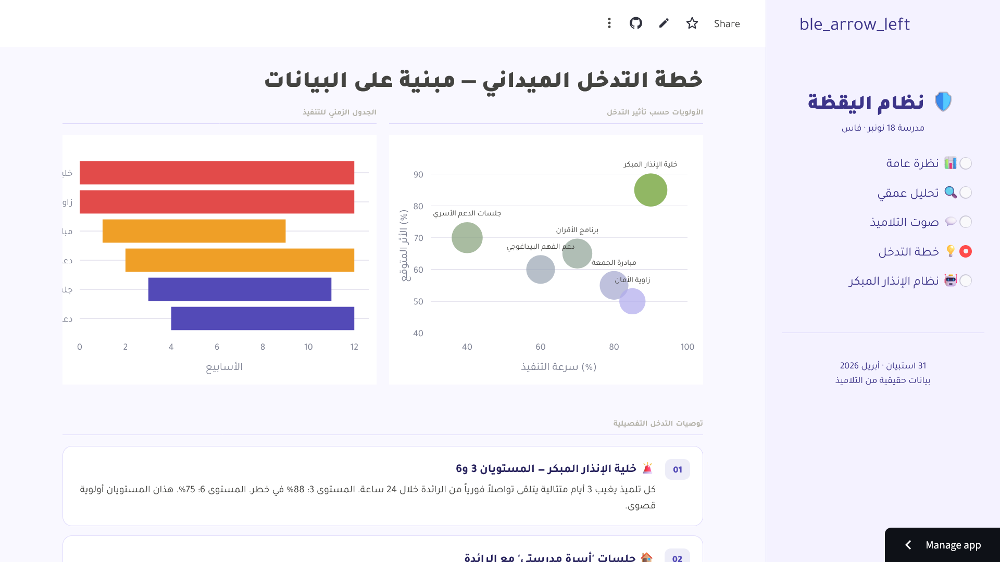

# Educational Vigilance System (EVS)
### *Predictive Data Science to Combat School Absenteeism*

[](https://share.streamlit.io/)
[](https://meek-cannoli-ecf7f5.netlify.app/)

##  Project Vision
This system was developed for **18 November School (Fes, Morocco)** to address the high rates of student absenteeism. By combining field sociology with data science, the EVS identifies patterns of vulnerability and provides educators with a predictive tool to intervene before a student drops out.

---

## 🛰️ The Data Journey

### 1. Data Collection
Real-time field data was collected directly from 31 students using a custom-built digital platform.
* **Survey Platform:** [Access the Field Form here](https://meek-cannoli-ecf7f5.netlify.app/)
* **Methodology:** Students provided qualitative and quantitative input regarding their home life, school safety, and academic struggles.

### 2. Data Processing & EDA
The raw data was cleaned and transformed into a structured format (`cleaned_data.csv`).
* **Encoding:** Qualitative Arabic text was standardized for statistical analysis.
* **Feature Engineering:** Weights were assigned to variables like "Family Stability" and "Peer Influence" based on observed correlations.

---

## 🖥️ Application Architecture

The dashboard is built using **Streamlit** with a professional **Light Theme** and full **RTL** support for Arabic users.


###  Strategic Overview
Displays the **Human Grid** where each icon represents a real student. 
* **Finding:** According to the findings, 71% of students who confirmed frequent absenteeism are categorized in the 'Critical Risk' zone (defined as 3+ days of absence monthly).




###  Deep Dive Analysis
Uses **OLS Regression Curves** and **Impact Disks** to prove the causality between environment and attendance.
* **Finding:** Family issues are the #1 driver of absenteeism, followed by academic "Ease of Understanding."






### 🤖 Predictive AI Robot
An early-warning diagnostic tool. By inputting 7 key parameters, the "Robot" calculates a precise **Risk Score** to help teachers prioritize interventions.


---

## 🛠️ Technical Stack
* **Frontend:** Streamlit (Custom CSS/HTML injection for RTL)
* **Analytics:** Pandas, NumPy
* **Visualization:** Plotly Express & Graph Objects (Interactive curves and gauges)
* **Data Source:** CSV / Digital Survey Integration

---

## 🚀 How to Run locally
1. Clone this repository.
2. Install the dependencies in uv.lock:
   ```bash
   pip install streamlit pandas plotly  seaborn statsmodels matplotlib